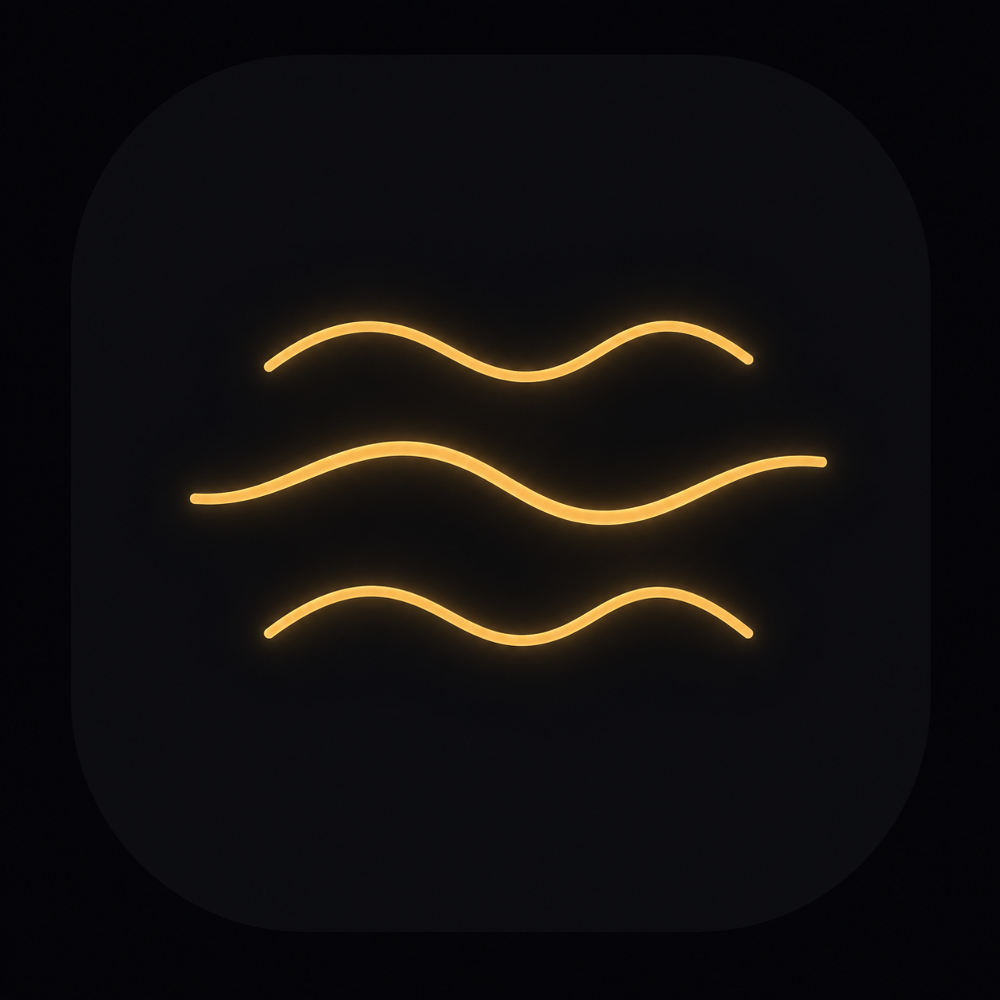
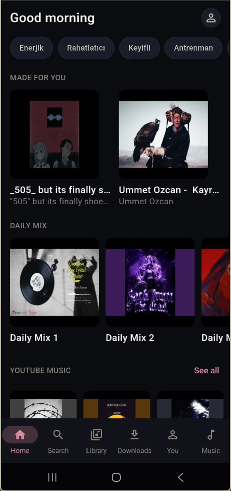
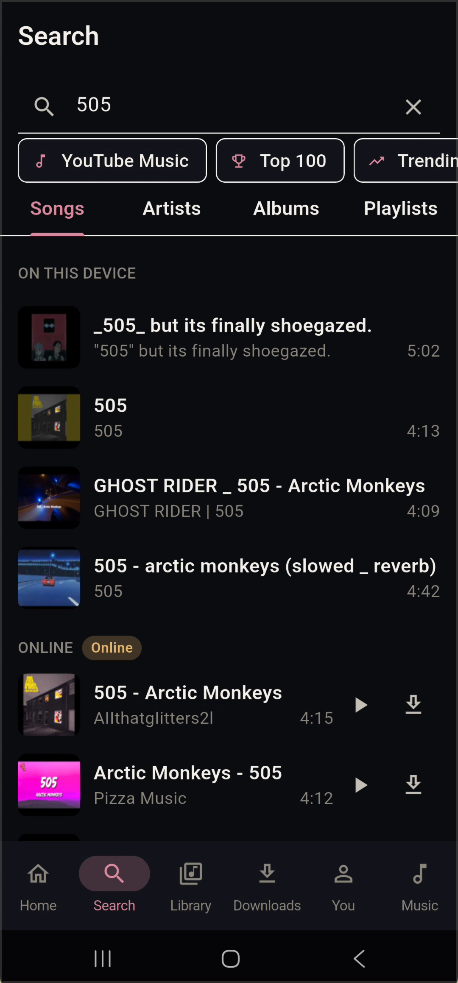
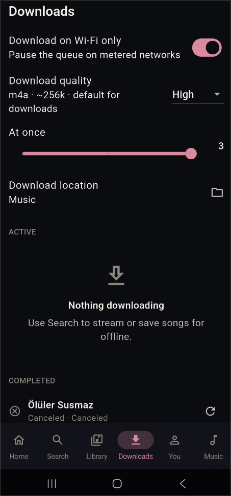
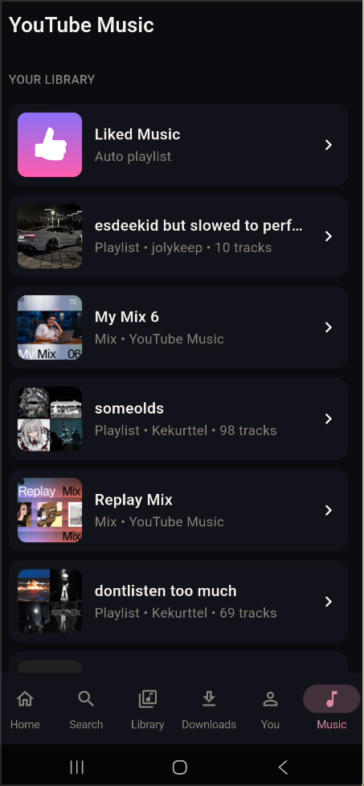
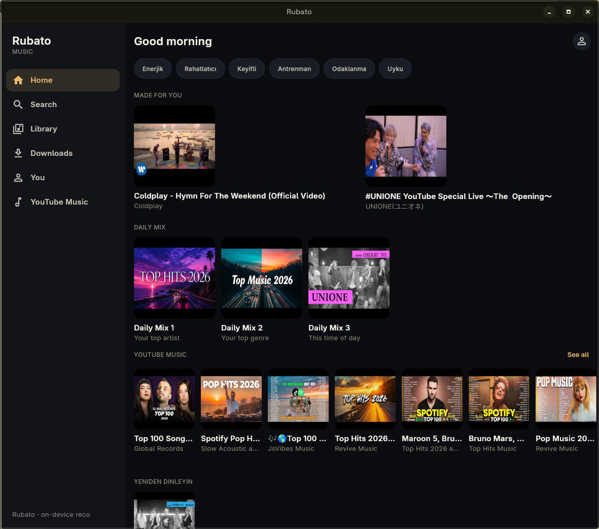
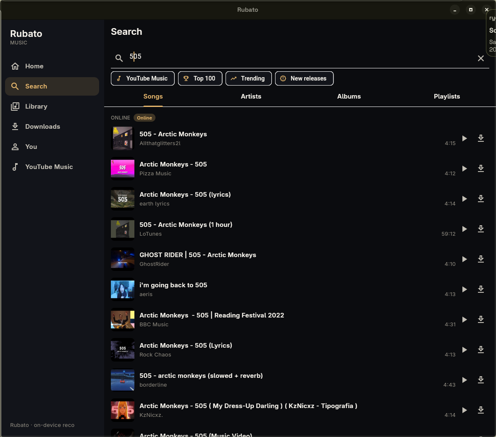
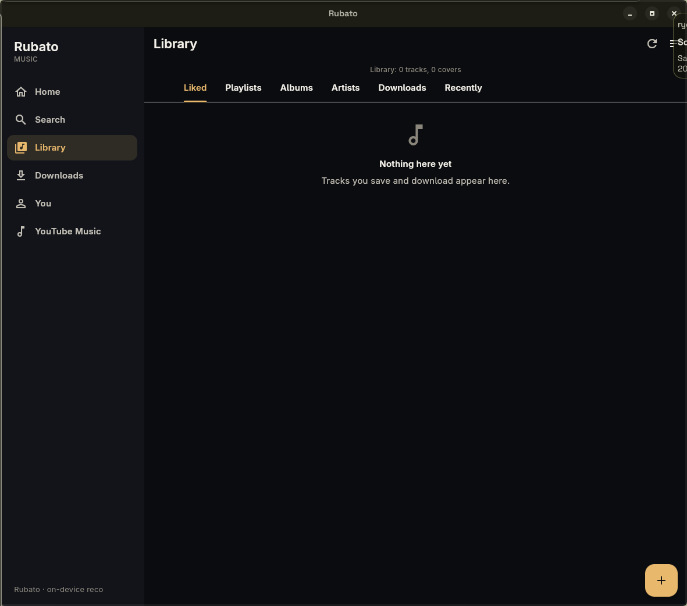
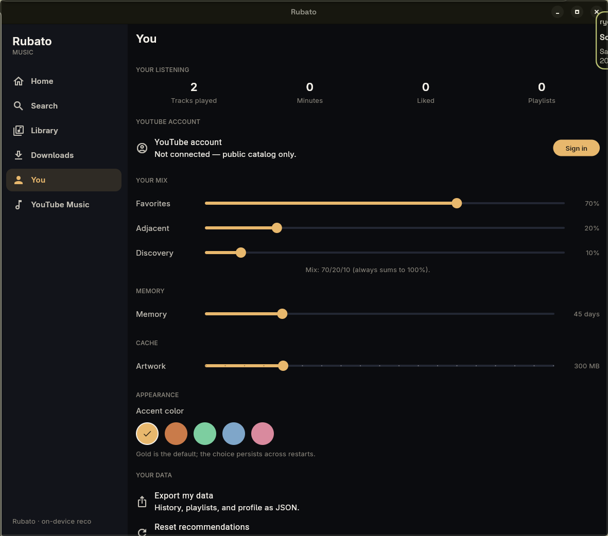

<div align="center">



# RUBATO

**A local-first music player built around the way you actually listen.**

[Download](#downloads) · [Screens](#screens) · [How it works](#how-it-works) · [Privacy](#privacy) · [Desktop Beta](#desktop-beta)

</div>

---

Rubato is a privacy-first music player for Android and desktop. Your library, likes, playlists, listening history and recommendation profile stay on the device. Online access is used as a source for search, metadata, artwork and authorized playback/download operations.

The interface is intentionally closer to a quiet listening room than a conventional music dashboard: dark surfaces, restrained gold/pink accents, large artwork and very little visual noise.

> **Mobile is the primary experience.** The desktop build is available as a **Beta**; desktop feature compatibility is currently limited and some interactions are designed around the mobile layout.

## What it does

- Local music library with artwork and metadata
- YouTube Music catalog/search integration through yt-dlp
- YouTube account library and personal playlist import
- Liked songs, playlists, Daily Mixes and on-device recommendations
- Stream first, download when you want an offline copy
- Download queue with configurable concurrency and Music-folder default
- Android media controls / notification playback
- Track metadata and custom cover editing
- Playlist management and Daily Mix saving
- Local SQLite storage with no analytics or advertising SDK

## Screens

### Mobile

<p align="center">
  
  
  
  <br>
  <sub>Home · Search · Library</sub>
</p>

<p align="center">
  
  
  
  <br>
  <sub>Downloads · You · YouTube Music</sub>
</p>

### Desktop

<p align="center">
  
  <br>
  <sub>Home</sub>
</p>

<p align="center">
  
  <br>
  <sub>Search</sub>
</p>

<p align="center">
  
  <br>
  <sub>Library</sub>
</p>

<p align="center">
  
  <br>
  <sub>You</sub>
</p>

<p align="center">
  
  <br>
  <sub>YouTube Music</sub>
</p>

The desktop UI is intentionally kept close to the mobile product, but it is not yet the main target. Expect incomplete desktop-specific polish and compatibility gaps.

## How it works

Rubato is split into a small set of independent layers:

```text
Flutter app
├── UI + navigation
├── Playback / Android media session
├── Music providers
│   ├── Local files
│   ├── yt-dlp search / stream / download
│   └── deterministic fake provider for tests
├── Download queue
├── Drift / SQLite
└── Recommendation engine
    └── runs from local listening data only
```

Local tracks are indexed into SQLite. Playback opens the local file directly when one exists; online tracks are resolved through yt-dlp into a playable audio URL. Downloads run through a persistent queue and are renamed using the track's human-readable title instead of the provider's internal ID.

Recommendations are generated on-device. Listening events update artist, genre, recency, completion, like and time-of-day signals. The ranker then creates mixes and recommendation shelves without sending that profile to a server.

## YouTube Music

You can use Rubato without an account for public catalog search and playback. Connecting a YouTube account adds the account-side library flow, including personal playlists and liked content where the session exposes them.

Account data is kept local to the app. Rubato does not ship a backend that stores your YouTube session or listening profile.

Online functionality is deliberately routed through the yt-dlp provider. Rubato does not implement a private YouTube API, DRM bypass, or a server-side account proxy.

## Privacy

There is no analytics SDK, advertising ID, recommendation server or cloud database for your listening data. The following stay on the device:

- listening history and play events
- likes and dislikes
- playlists
- recommendation profile and mix snapshots
- search history
- artwork cache

Network access is for music-source operations such as search, metadata, artwork and authorized playback/download resolution. See the source and project specification for the complete architecture and privacy constraints.

## Desktop Beta

The desktop build is functional, but **desktop compatibility is currently limited**. Rubato is developed mobile-first and the Android build is the better-tested, more complete experience.

Linux is currently the easiest desktop release to run. Windows builds can be produced from the same Flutter project; the repository also contains an automated release workflow for Windows, Linux and Android.

Do not treat the Desktop Beta as feature-complete parity with mobile.

## Downloads

Prebuilt binaries ship with every [GitHub release](https://github.com/kekurttel/rubato/releases) — no source build needed:

- Android APK — recommended, primary experience: `Rubato-<version>-android.apk`
- Linux Desktop Beta: `Rubato-<version>-linux-x64.tar.gz`
- Windows Desktop Beta: `Rubato-<version>-windows-x64.zip`

Pick the assets attached to the latest release.

The tutorials below stay for everyday installs, and [Build from source](#build-from-source) remains for contributors who want to compile Rubato themselves.

### Android — recommended

1. Open the [latest release](https://github.com/kekurttel/rubato/releases/latest) on your Android device.
2. Download the `Rubato-<version>-android.apk` asset.
3. Open it from Files / Downloads.
4. Allow installation from that source if Android asks.
5. Install and launch Rubato.
6. Grant music/media access when requested if you want to use local files.

Android 13+ may present the media permission separately from notification permission. Both are only needed for their respective features.

### Linux — Desktop Beta

Download `Rubato-<version>-linux-x64.tar.gz` from the [latest release](https://github.com/kekurttel/rubato/releases/latest).

```bash
# 1. Download the archive, then enter the directory where it is saved.
cd ~/Downloads

# 2. Create a clean directory for the bundle.
mkdir -p rubato-linux-x64

# 3. Extract the archive into that directory.
tar -xzf Rubato-<version>-linux-x64.tar.gz -C rubato-linux-x64

# 4. Start Rubato.
cd rubato-linux-x64
./rubato
```

If the file is not executable, run `chmod +x rubato` and start it again. The archive is a self-contained Flutter Linux bundle; it contains the `rubato` executable and its `data/` directory.

For a source build, use a Linux machine with Flutter desktop support enabled:

```bash
cd aurora/apps/aurora_mobile
flutter pub get
flutter build linux --release
./build/linux/x64/release/bundle/rubato
```

The Linux release is x64. Desktop Beta compatibility is intentionally marked as limited; mobile remains the primary target.

### Windows — Desktop Beta

Download `Rubato-<version>-windows-x64.zip` from the [latest release](https://github.com/kekurttel/rubato/releases/latest), extract it anywhere, and run `rubato.exe`.

A fresh Windows bundle is produced by the release workflow for every release tag. If you are building locally instead, use a Windows machine with Flutter desktop support and Visual Studio's C++ desktop workload installed:

```powershell
cd aurora\apps\aurora_mobile
flutter pub get
flutter build windows --release
```

Then run `build\windows\x64\runner\Release\rubato.exe`.

Windows is part of the Desktop Beta, not the primary compatibility target. Expect fewer tested integrations than on Android.

## Build from source

Requirements: Flutter 3.44.x and Dart 3.12.x.

```bash
git clone https://github.com/kekurttel/rubato.git
cd rubato
dart pub global activate melos
melos bootstrap
melos run gen
melos run analyze
melos run test
```

To work directly on the mobile app:

```bash
cd apps/aurora_mobile
flutter run
```

The repository is a Melos workspace. `apps/aurora_mobile` contains the product UI and platform shell; the `packages/` directories isolate playback, providers, downloads, database and recommendation logic.

## Source and downloads

Rubato uses yt-dlp as an external music-source mechanism. It is intended for content you are allowed to access, stream or download. The project does not implement DRM circumvention or ship a private YouTube API.

The included APK and Linux bundle are release artifacts, not personal backups. No account cookies, API keys, tokens, signing keys, local databases or machine-specific configuration belong in this repository.

## License

GNU General Public License v2.0 (GPL-2.0). See `LICENSE`. If you distribute a modified version, the modified source must remain available under GPL-2.0; a public fork is the simplest way to comply.

<div align="center">

**Rubato**

*listen locally. keep the profile local.*

</div>
